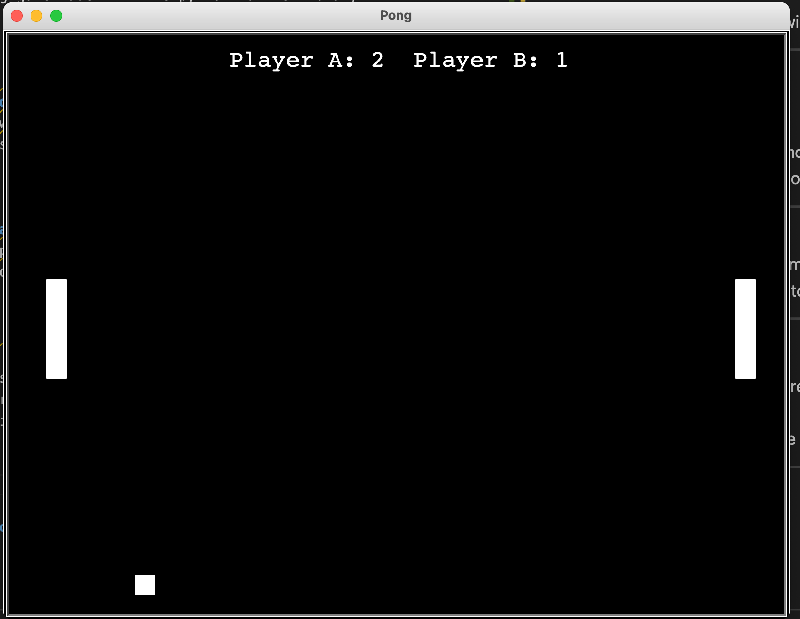
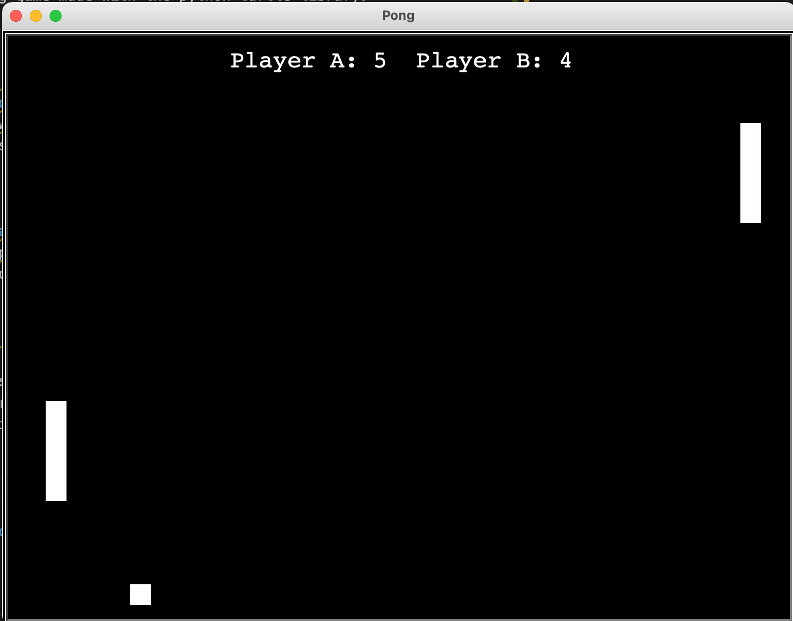

# PONG

## Overview

Classic pong game made with the python turtle library. 

---

## Controls 
### Left Paddle 
- Use the "w" key to move up
- Use the "s" key to move down

---

### Right Paddle 
- Use the up arrow to move up
- Use the down arrow to move down

---
## Features 

- Displays score on screen and automatically updates each players score 
- Retro audio when the ball collides with a paddle or appropriate wall

---

## Screenshots

---

